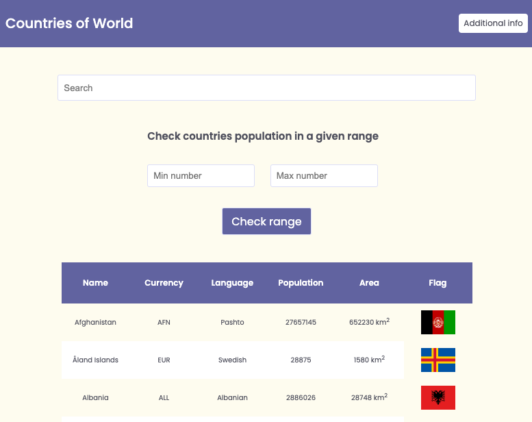

# Country information app

Application communicates with REST Countries API and display specific information about countries.

Live demo: [https://paulaami.github.io/REST-Countries/](https://paulaami.github.io/REST-Countries/)

## Table of Contents
* [General Info](#general-information)
* [Technologies Used](#technologies-used)
* [Screenshots](#screenshots)
* [Setup](#setup)

## General Information

    Application displays the table with all countries with following columns: name, currency, language, population, area, flag.
    The user has the ability to sort each column in the table (except flag) with ascending / descending order. 
    By using search input user can filter table by values in columns. It is also possible to search for countries that have population in a given range.
    
    The application includes an additional page containing general information about the countries:
    a) total number of countries
    b) top 5 most common languages
    c) top 5 most common currencies
    d) average population
    e) average area
    f) average number of neigbours

## Technologies Used

- HTML 
- SCSS
- JavaScript ES6

## Screenshots

## Setup
Live demo: [https://paulaami.github.io/REST-Countries/](https://paulaami.github.io/REST-Countries/)

